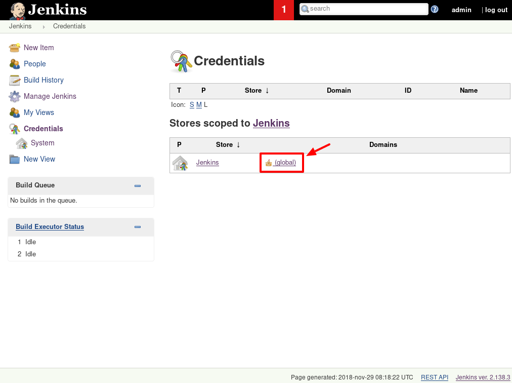
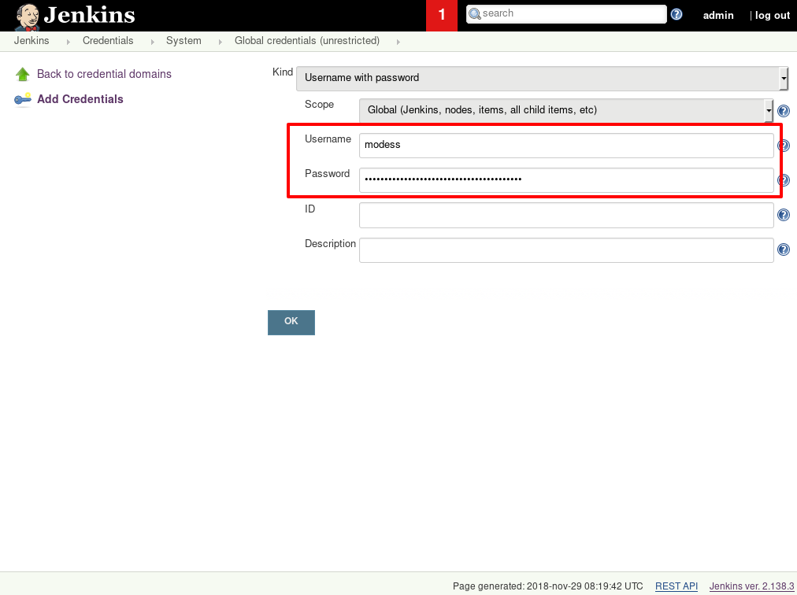
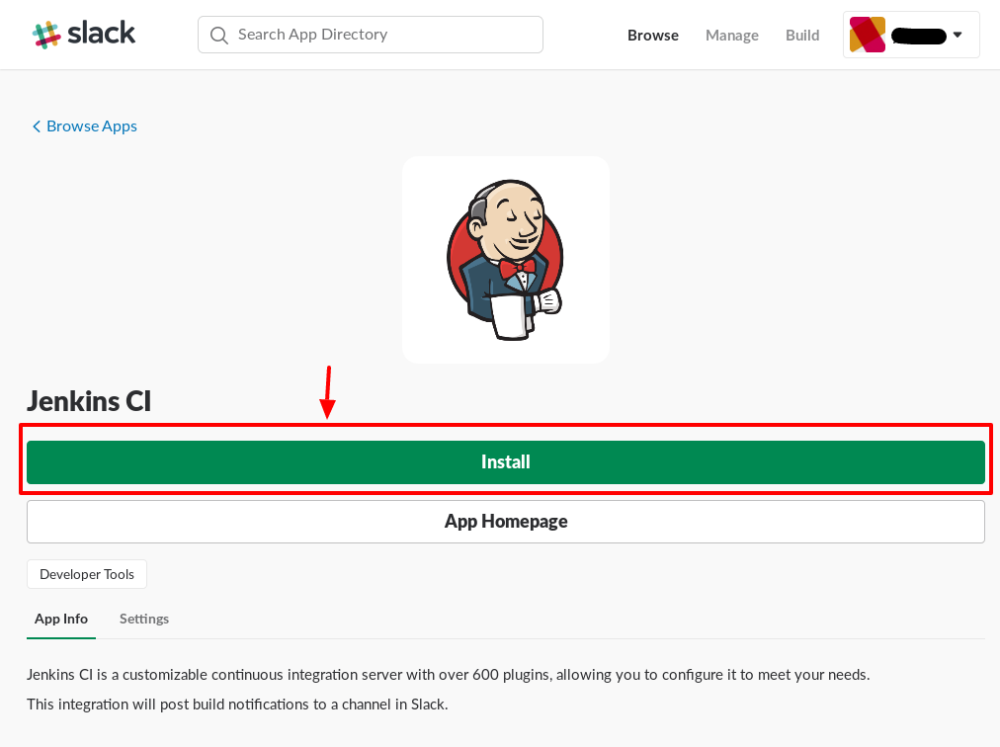

## PATH environment variable

Jenkins will need to be able to execute the different tools we install through Composer to run static analysis on your code, we need to tell it where to find these binaries.

In the Jenkins web interface click "Manage Jenkins" in the left sidebar menu.


---

Then go to "Configure System".


---

Here you'll find _Global Properties_, then click the checkbox next to _Environment Variables_ and click _Add_. In _Name_ you enter `PATH` and in _Value_ you enter `$PATH:vendor/bin:/var/lib/jenkins/.composer/vendor/bin`. Then hit _Save_.


---

## Github authorization

### Create deploy key

!!! note "For private repositories only"
    This step is not necessary if you will be building a project from a public repository.

We'll generate an SSH key for the `jenkins` user on the server. So in your terminal write the following command and follow the instructions:

```
sudo su - jenkins -c "ssh-keygen"
```

Then output the public key and copy it for adding it on Github for your repository:

```
sudo su - jenkins -c "cat ~/.ssh/id_rsa.pub"
```

Then head over to Github, specifically to the *Deploy keys* settings page for your repository which can be access directly with `https://github.com/<owner>/<name>/settings/keys`.

Now click *Add deploy key*.


---

Enter a title for your key and then paste the public key in the textarea, then click *Add key*.


---

### Add host key verification

We need to say we trust Github's domain, since Jenkins can't perform this on its own.

```
sudo su - jenkins -c "ssh-keyscan -t rsa github.com >> ~/.ssh/known_hosts"
```

---

### Create access token

!!! note "Working in a team?"
    If you're setting this up for the company or team you're working for, you should consider creating a "bot" user that is owned by the company or team. Then invite that user to the repository and create an access token with it. This way the access token isn't tied to your personal account.

Head over to Github, specifically to the *Personal access tokens* settings page which can be access directly with `https://github.com/settings/tokens`. There click *Generate new token*.


---

Enter a title for your token, then give the token access for the *repo* scope. Then click *Generate token*.


---

Now you'll be presented with your token. **Copy this token and save it somewhere**, because you won't be able to view it again. If you lose the token you have to create a new one.


---

### Add Github credentials in Jenkins

Now you have to add this access token in Jenkins, so start by going do your dashboard and click *Credentials*.


---

Continue on by clicking *(global)*.



---

Now go to *Add Credentials*.


---

Everything should now be preset, but make sure all dropdowns match the ones on this image and enter the Github username in *Username*, and add the **access token** as *Password*. Then click *OK*.



---

## Slack integration

If you chose a Slack channel to send notifications to when generating files for your application, you need to set up the integration for it.

Start by setting up an integration for your Slack channel by visiting `https://<your-slack-subdomain>.slack.com/apps`. Here you search for *jenkins* and click the *Jenkins CI* integration.


---

Continue by clicking *Install*.



---

Chose which channel to post notifications to, even though your application configuration will override this setting. Then click *Add Jenkins CI integration*


---

Now you'll be presented with the installation instructions for the integration. Scrolling down to *Step 3* you'll find your *Base URL* and *Integration Token*. Copy these or leave the page up for later reference.


---

## Setup build project

Now it's only a matter of creating a build project in Jenkins to start using CI! Head to the Jenkins dashboard and click *New Item*.


---

Give your build project a title and select *Multibranch Pipeline* as the type for it and continue by clicking *OK*.


---

Now under *Branch Sources*, click *Add source* and select *Git*.


---

Add your repository in the format `git@github.com:<owner>/<name>.git`.


---

Now add the credentials you've previously created by using the dropdown and selecting it.


---

Now hit *Save* and you're done. Jenkins will now build all your branches and your pull requests!