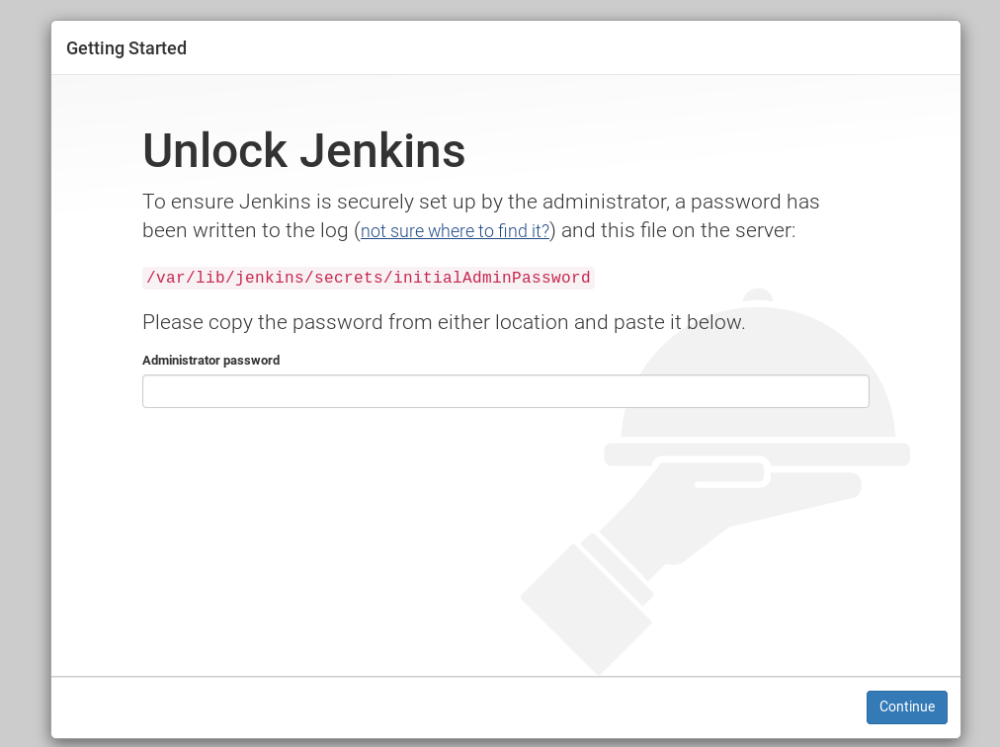
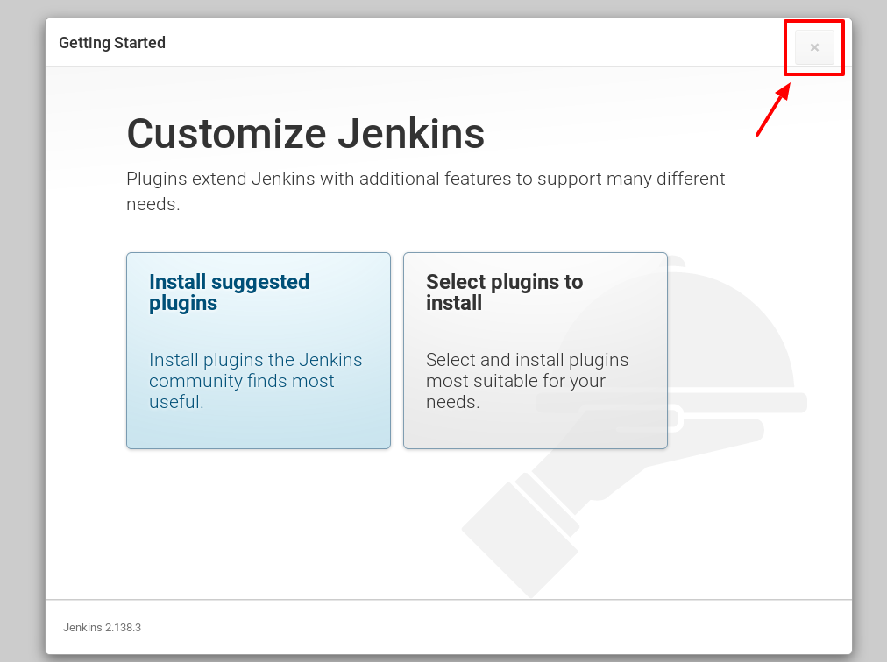
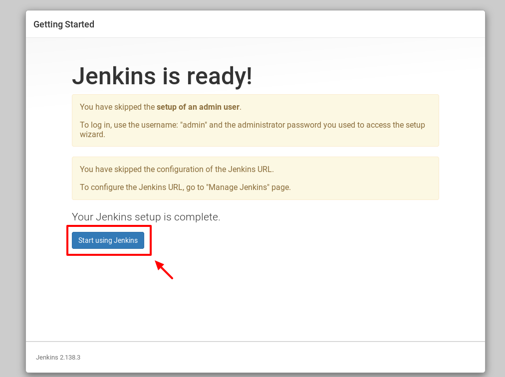
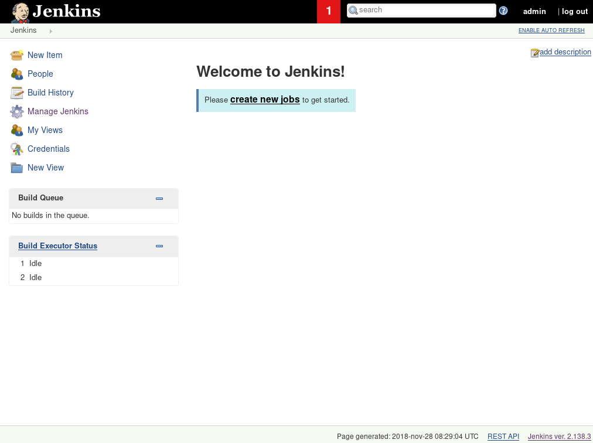

## Run the installation script


Run it using:
```
sh jenkins-install.sh
```

When prompted about Java information, press `Enter` to continue.

After installation is complete, you'll see the IP address Jenkins is available at and a admin account to login with.

```
##########################################
# INSTALLATION COMPLETE                  #
##########################################
Jenkins should be available at http://<ip>:8080
Login with: admin / <generated password> 
```

### Installed software

* Curl
* Unzip
* Java 8
* Jenkins, with plugins
    - pipeline-model-definition
    - pipeline-stage-view
    - slack
    - checkstyle
    - cloverphp
    - crap4j
    - dry
    - htmlpublisher
    - pmd
    - violations
    - warnings
    - xunit
    - git
    - greenballs
* PHP, with extension
    - php-cli
    - php-xdebug
    - php-xsl
    - php-dom
    - php-zip
    - php-mbstring
* Composer
* Global PHP packages
    - phpunit/phpunit 
    - squizlabs/php_codesniffer
    - phpmd/phpmd
    - sebastian/phpcpd
    - jakub-onderka/php-parallel-lint


!!! note "Additional PHP extensions"
    If your application requires other extensions than the default ones provided, simply install them yourself. If you wanted to install the _curl_ and _gd_ extensions for example, replace the version with the PHP version you chose:

    ```
    sudo apt-get install -y php7.2-curl php7.2-gd
    ```

## First login

Navigate to the URL provided by the installer script. You'll be presented with this screen where you enter the provided admin password:



---

After logging in you'll be given the option to install plugins. Since the installer already have installed the plugins you need, just press the `X` in the top right corner to continue.



---

Then simply click `Start using Jenkins`.



---

!!! warning "White screen?"
    If you get just a white page of nothing after you do this, restart the Jenkins service by running:

    ```
    sudo service jenkins restart
    ```

    Then refresh the page.

You'll now be met by Jenkins start page.



---